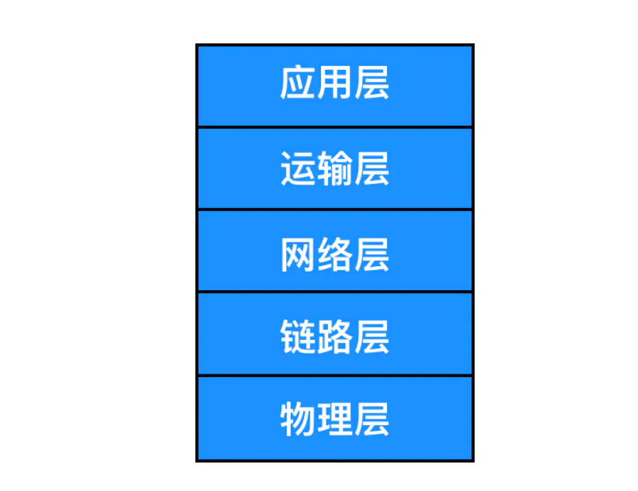
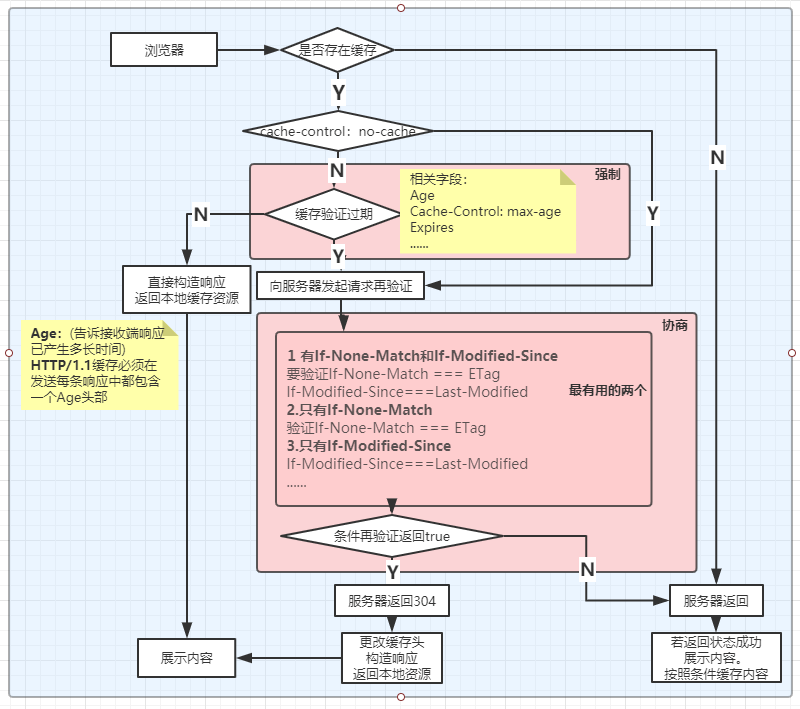
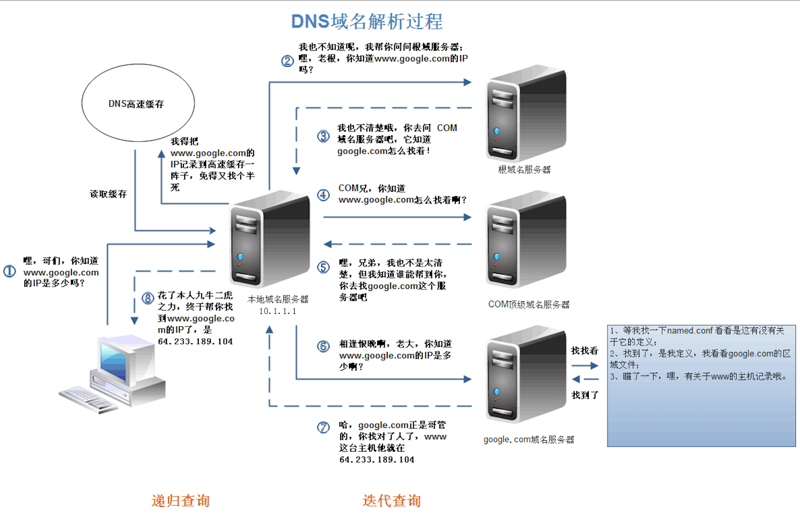

# HTTP

[TOC]

## 浏览器原理

### 线程和进程

#### 进程

资源分配的最小单位，有独立的栈和堆内存。每启动一个系统会为他分配地址空间。进程之间的通信是通过IPC完成的。

#### 线程

程序执行的最小单位，只有独立的栈内存，共享堆内存，也就是共享进程里的数据。因为线程都在进程里。多线程只要有一个线程死掉，整个进程也死掉了，而一个进程死掉并不会对其他进程造成影响。多线程程序的难点在于如何处理好同步和互斥。

### 浏览器时代

- 最开始：单进程，不稳定，不流畅，不安全

### 多进程时代

- 浏览器进程
- 渲染进程
- 网络进程
- GPU进程
- 插件进程

### 未来架构

面向服务的架构（SOA）

## 前端网络

### TCP/IP

`TCP/IP` 协议你一定听过，TCP/IP 我们一般称之为`协议簇`，就是 TCP/IP 协议簇中不仅仅只有 TCP 协议和 IP 协议，它是一系列网络通信协议的统称。而其中最核心的两个协议就是 TCP / IP 协议，其他的还有 UDP、ICMP、ARP 等等，共同构成了一个复杂但有层次的协议栈。

`TCP` 协议的全称是 `Transmission Control Protocol` 的缩写，意思是`传输控制协议`，HTTP 使用 TCP 作为通信协议。TCP协议提供了**面向连接**的服务，**保证并确认报文是否到达**，并提供了**拥塞机制**来控制网络传输，因此当网络拥塞时，会抑制其网络传输速率。

`UDP`协议是提供**无连接服务**。它**不具备可靠性**的特征，没有流量控制，也没有拥塞限制。但是传输快。

`IP` 协议的全称是 `Internet Protocol` 的缩写，它主要解决的是通信双方**寻址**的问题。IP 协议使用 `IP 地址` 来标识互联网上的每一台计算机，可以把 IP 地址想象成为你手机的电话号码，你要与他人通话必须先要知道他人的手机号码，计算机网络中信息交换必须先要知道对方的 IP 地址。

### 网络模型



#### 基本模型

- 应用层：为应用程序提供所需要的各种服务、例如：**http**、**ftp**、**DNS**、**SMTP**等
- 传输层：四层交换机、四层路由器为应用层实体提供端到端的通信功能，保证数据包顺序传送及数据的完整性，该层定义了两个主要的协议：**传输控制协议TCP**和**用户数据报协议UDP**。
- 网络层：路由器、三层交换机。主要解决主机到主机的通信问题。 **IP协议**是网际互联层最重要的协议。
- 数据链路层：为了将分组从一个节点（主机或路由器）运输到另一个节点，网络层必须依靠链路层提供服务。链路层包括以太网、WiFi 和电缆接入的 `DOCSIS` 协议，因为数据从源目的地传送通常需要经过几条链路，一个数据包可能被沿途不同的链路层协议处理，我们把链路层的分组称为 `帧(frame)`
- 物理层：关于双绞铜线、关于同轴电缆、关于光纤等等。

#### OSI网络模型


1. 应用层：为应用程序提供服务&gt;软件调用
2. 表示层：数据格式转换，数据加密
3. 会话层：建立、管理和维护会话（对应主机进程，指本地主机与远程主机正在进行的会话）
4. 传输层：建立、管理和维护端到端的连接，传输层的作用是为上层协议提供端到端的可靠和透明的数据传输服务，包括处理差错控制和流量控制等问题。该层向高层屏蔽了下层数据通信的细节，使高层用户看到的只是在两个传输实体间的一条主机到主机的、可由用户控制和设定的、可靠的数据通路。我们通常说的，TCP UDP就是在这一层。端口号既是这里的“端”。
5. 网络层：IP选址及路由选择，本层通过IP寻址来建立两个节点之间的连接，为源端的运输层送来的分组，选择合适的路由和交换节点，正确无误地按照地址传送给目的端的运输层。就是通常说的IP层。这一层就是我们经常说的IP协议层。IP协议是Internet的基础。
6. 数据链路层：提供介质访问和链路管理（网卡以内，硬件MAK地址属于数据链路层）。
7. 物理层：中继器、集线器、双绞线，实际最终信号的传输是通过物理层实现的。通过物理介质传输比特流。规定了电kkd平、速度和电缆针脚。常用设备有（各种物理设备）集线器、中继器、调制解调器、网线、双绞线、同轴电缆。这些都是物理层的传输介质。

## HTTP请求流程


HTTP协议采用了请求/响应模型。客户端向服务器发送一个请求报文，请求报文包含请求的方法、URL、协议版本、请求头部和请求数据。服务器以一个状态行作为响应，响应的内容包括协议的版本、成功或者错误代码、服务器信息、响应头部和响应数据。

__以下是 HTTP 请求流程：__

1. 构建请求。
2. 查询缓存：强缓存和协商缓存。
3. 准备IP地址：DNS。
4. 等待TCP队列。

5. 建立TCP连接（3次握手）。

6. 发送HTTP请求通过TCP套接字，客户端向Web服务器发送一个文本的请求报文，一个请求报文由请求行、请求头部、空行和请求数据4部分组成。

7. 服务器接受请求并返回HTTP响应Web服务器解析请求，定位请求资源。服务器将资源复本写到TCP套接字，由客户端读取。一个响应由状态行、响应头部、空行和响应数据4部分组成。

8. 释放连接（四次挥手）。TCP连接若connection 模式为close，则服务器主动关闭TCP连接，客户端被动关闭连接，释放TCP连接。若connection 模式为keep-alive，则该连接会保持一段时间，在该时间内可以继续接收请求。

## http协议的简史和未来，

### 0.9版本

只有一个请求行，没有请求头和请求体。服务器也没有返回头信息，返回的都是html文件，所以用ASCII字符流来传输的。早期HTTP只有GET。

### 1.0版本

有了请求头和响应头（Head），引入了状态码，提供了cache机制，加入了用户代理。

### 1.1版本

一共有五个方法 **get**  **post**  **put**  **delete**  **head**  另有(**trace**  **connect**  **options**)。  

- 增加了长链接（keep-alive）。
- 不成熟的管线化：TCP队头堵塞。
- 提供了虚拟主机（host字段）。
- 动态生成内容提供完美支持（Bigpipe）。
- cookie和安全机制。

HTTP/1.1 对网络做了大量的优化，主要表现在以下三点：

1. 增加持久链接。
2. 每个http请求可以链接6个持久的TCP链接。
3. 使用CDN实现域名分片机制。

HTTP/1.1也有几个重要问题：c

1. 对带宽的利用率不理想。
2. TCP的慢启动。
3. 同时开启多个TCP会引起竞争。
4. 队头阻塞。（若第一个请求的响应迟迟不能返回，那后面的响应都会被阻塞，）

### 2.0版本

在应用层方面解决队头堵塞问题。一个域名只用一个TCP长链接。但是如果有一个丢包，则会造成TCP阻塞。

- 多路复用机制

- 二进制分帧层
- 头部压缩。
- 服务端推送

### 3.0版本

在传输层解决队头阻塞问题。因为用的是基于`UDP`的`QUIC`协议。

实现了类似TCP的流量控制，传输可靠性功能。

增加了TSL加密。

快速握手和多路复用。

缺点是对UDP的优化做的不多。

### http状态码

- 1xx：指示信息--表示请求已接收，继续处理。

- 2xx：成功--表示请求已被成功接收、理解、接受。
    204：请求被受理理但没有资源可以返回 。
    206：客户端只是请求资源的⼀一部分，服务器器只对请求的部分资源执⾏行行GET⽅方法，相应报⽂文中通过 Content-Range指定范围的资源。
    
- 3xx：重定向--要完成请求必须进行更进一步的操作。
  
    301：永久性重定向
    
    302：临时重定向。
    303：与302状态码有相似功能，只是它希望客户端在请求⼀一个URI的时候，能通过GET⽅方法重定向到另⼀一个URI上。
    304：发送附带条件的请求时，条件不不满⾜足时返回，与重定向⽆无关。
    307：临时重定向，与302类似，只是强制要求使⽤用POST⽅方法，还缓存策略也会遇到提示。
    
- 4xx：客户端错误--请求有语法错误或请求无法实现 。
    400：请求报⽂文语法有误，服务器器⽆无法识别 。
    401：请求未经授权，这个状态代码必须和WWW-Authenticate报头域一起使用 。
    403：请求的对应资源禁⽌止被访问。
    404：Not Found 请求资源不存在。
    403：Forbidden 权限不够。
    405：Method Not Allowed 请求方法不被允许。
    
- 5xx：服务器端错误--服务器未能实现合法的请求 。
    500：服务器发生不可预期的错误 。
    502：请求到了反向代理了，但是反向代理不过去指定服务器。
    503：服务器当前不能处理客户端的请求，一段时间后可能恢复正常请求报头详细字段request。 

## Http相关组件

### CDN

CDN的全称是`Content Delivery Network`，即`内容分发网络`，它应用了 HTTP 协议里的缓存和代理技术，代替源站响应客户端的请求。CDN 是构建在现有网络基础之上的网络，它依靠部署在各地的边缘服务器，通过中心平台的负载均衡、内容分发、调度等功能模块，使用户`就近`获取所需内容，降低网络拥塞，提高用户访问响应速度和命中率。CDN的关键技术主要有`内容存储`和`分发技术`。

### WAF

WAF 是一种 Web 应用程序防护系统（Web Application Firewall，简称 WAF），它是一种通过执行一系列针对HTTP / HTTPS的`安全策略`来专门为Web应用提供保护的一款产品，它是应用层面的`防火墙`，专门检测 HTTP 流量，是防护 Web 应用的安全技术。

WAF 通常位于 Web 服务器之前，可以阻止如 SQL 注入、跨站脚本等攻击，目前应用较多的一个开源项目是 ModSecurity，它能够完全集成进 Apache 或 Nginx。

## Http相关的协议

### DNS

把 IP 地址转换为便于人类记忆的协议就是 `DNS 协议`。

DNS 的全称是`域名系统（Domain Name System，缩写：DNS）`，它作为将域名和 IP 地址相互映射的一个分布式数据库，能够使人更方便地访问互联网。

### URI / URL

你输入的地址格式必须要满足 `URI` 的规范。

`URI`的全称是（Uniform Resource Identifier），中文名称是统一资源标识符，使用它就能够唯一地标记互联网上资源。

`URL`的全称是（Uniform Resource Locator），中文名称是统一资源定位符，也就是我们俗称的`网址`，它实际上是 URI 的一个子集。

**URI** 包含 **URL** 和 **URN**（统一资源名称）。

## 请求报头字段

### http 1.1 请求字段：

1. Accept：text/html;charset=utf-8 指定客户端接受哪些类型的信息（响应字段Content-Type对应）
2. Accept-Encoding：gzip 服务器支持压缩，请求报头域类似于Accept，但是它是用于指定可接受的内容编码。
3. Accept-Language：zh-CN,zh 指定一种自然语言，zh-CN语言Authorization请求报头域主要用于证明客户端有权查看某个资源。当浏览器访问一个页面时，如果收到服务器的响应代码为401（未授权），可以发送一个包含Authorization请求报头域的请求，要求服务器对其进行验证。
4. Connection：keep-alive 服务器支持长链接。
5. Cookie：Host：sp0.baidu.com 请求报头域主要用于指定被请求资源的Internet主机和端口号，它通常从HTTP URL中提取出来的，发送请求时，该报头域是必需的。

6. Referer：https://www.baidu.com/ 你的请求来源路径，不是指定来源的不给访问。
7. User-Agent：Mozilla/5.0 (Windows NT 6.1; WOW64) 请求报头域允许客户端将它的操作系统、浏览器和其它属性告诉服务器。

### http2.0请求头字段:

1. authority：ke.qq.com 请求认证部份。

2. method: GET 目标URL模式（请求）。
3. path： 请求链接对应服务器目录。
4. scheme: https 目标URL模式（请求）。
5. host字段。
6. status 状态码。
7. response 响应报头字段。
8. Accept-Ranges：bytesCache-Control:max-age=0 缓存策略。
9. Connection：keep-alive 服务支持长链接（不支持就没有这一行），和请求报头字段一一对应。
10. Content-Encoding：gzip 浏览器支持压缩，指定内容编码。
11. Content-Type：text/html;charset=utf-8 返回给页面内容的描述，是html还是图片等，以及编码。
12. Date：Thu, 22 Nov 2018 05:04:17 GMT 服务器响应时间（给缓存用的）国际标准时间。	
13. GMTExpires：Thu, 22 Nov 2018 05:04:17 GMT 缓存的有效时间（给缓存用的）。
14. Server：nodejs/1.0 这是说服务器用的是什么环境/版本。

## HTTPS协议  = HTTP+ 加密 + 认证 + 完整性保护

分析它拥有和http协议的所有功能，但是他安全性却高了，因为他在加密 .

> HTTPS并非是应用层的一种新协议，只是HTTP通信接口部分用SSL和TLS协议代替，

　HTTPS 是身披 SSL 外壳的 HTTP


### SSL

SSL 是独立于 HTTP 的协议，所以不光是 HTTP 协议，其他运行在应用层的 SMTP 和 Telnet 等协议均可配合 SSL 协议使用。可以说 SSL 是当今世界上应用最为广泛的网络安全技术。

**HTTP采用共享密钥加密和公开密钥加密两者并用的混合加密机制。**


HTTPS 也存在一些问题，那就是当使用 SSL 时，它的处理速度会变慢。

SSL 的慢分两种：一种是指通信慢。另一种是指由于大量消耗CPU 及内存等资源，导致处理速度变慢。

### 不使用https的原因

1. 与纯文本通信相比，加密通信会消耗更多CPU和内存资源。
2. 需要额外支付证书的费用。

### HTTP2优点

1. 多路路复⽤用允许同时通过单⼀一的 HTTP/2 连接发起多重的请求-响应消息。⽐比原⽹网站提升6倍。

2. 头部压缩。在应用层(HTTP/2)和传输层(TCP or UDP)之间增加了一个二进制分帧层。突破 HTTP1.1 的性能限制，改进传输性能，实现低延迟和⾼高吞吐量量。   

3. HTTP2服务端推送(Server Push)。


### HTTP不足

- 通信使用明文（不加密），内容可能会被窃听。
- 不验证通信方的身份，因此可能被伪造。
- 无法证明报文的完整性，所以有可能已遭篡改。

## HTTP缓存

> 缓存策略: 可分为 强缓存 和 协商缓存



### 强缓存

浏览器中缓存分两种，一种需要__http__请求，一种不需要。

在验证强缓存时，不用发送http请求。

在<span style="color:red">`HTTP/1.0`</span>时期用的是__Expires__，<span style="color:red">`HTTP/1.1`</span>时期用__Cache-Control__

#### Expires

__Expires__ 即过期时间 ，存在服务端返回的响应头中，告诉浏览器在这个过期时间都可以直接从缓存里面获取数据，无需再次请求。

```javascript
Expires Wed, 22 Nov 2019 08:41:00 GTM
```

表示资源在这个时间段过期，过期了就需要向服务端发请求。

这个方式有个问题就是__服务器的时间和浏览器的时间可能并不一致__，就会导致这个时间不准确所以被HTTP1.1版本抛弃。

#### Cache-Control

HTTP1.1中使用使用。

和__Expires__的本质不同在与没有采用<span style="color:red">`具体的过期时间点`</span>，而是采用过期时长来控制缓存，对应的字段是__max-age__。

```javascript
Cache-Control:max-age=3600
```

代表响应返回后在 3600 秒内可以直接使用缓存。

Cache-Control有其他字段：

__private__：这种情况就是只有浏览器能缓存，中间代理服务器不能缓存。

__no-cache__：跳过当前的强缓存，发送HTTP请求，直接进入__协商缓存阶段__。

__no-store__：非常粗暴，不进行任何形式的缓存。

__s-maxage__： 这和__max--age__长的比较像，区别在于s-maxage是针对服务器的缓存时间，用以多位用户使用的公共缓存服务器，对同一个用户重复返回响应的服务器没有作用。另外 s-maxage 会忽略Expires 及max-age。

当__Expires__和__Cache-Control__同时存在的时候，__Cache-Control__会优先考虑。

### 协商缓存

强缓存失效后，浏览器在请求头携带相应的__缓存tag__来想服务器发请求，由于服务器根据这个tag来决定是否使用缓存，这个就是__协商缓存__。

缓存tag分为两种：__Last-Modified__和__ETag__，他们不存在绝对优势。

#### Last-Modified

即最后修改时间，在浏览器第一次给服务器发请求后，服务器会在响应头中加这个字段。

浏览器如果再次请求，会在请求头上携带<span style="color:red">`If-Modified-Since`（request）</span>字段，这个字段的值也就是服务器传来的__Last-Modified（response）__最后修改时间。

服务器拿到这个字段后悔和服务器中该资源最后修改时间对比：

- 如果请求头的这个值小于最后修改时间，返回新的资源。
- 否则返回304，直接用缓存。

#### ETag

<span style="color:red">`ETag`</span>是服务器根据当前文件的内容，给文件生成的唯一标识，只要里面的内容有改动，这个值就会变。服务器通过响应头把这个值给浏览器。

浏览器收到__ETag（response）__值，在下次请求时，将这个值作为__if-None-Match（request）__这个字段的内容，并发到请求头中，发给服务器。

服务器收到__If-None_Match__后，会跟服务器上改资源的ETag进行对比：

- 如果两者不一样，说明要更新，返回新的资源,并且__Last-Modified__的值为__If-None_Match__。
- 否则返回304，告诉浏览器使用缓存。

#### 两者对比

1. 在精准上，ETag优于Last-Modified.因为ETag是按照内容给资源上标识，因此能准确感知资源的变化，而Last-Modified就不一样，它在一些特殊情况下并不能感知。主要有两个情况：
   -  编辑了资源文件，但是文件内容并没有更改，这样也会造成缓存失效。 
   - 最小粒度只到 s， s 以内的改动无法检测到，原因是 UNIX记录MTIME只能精确到秒。
2. 在性能上，`Last-Modified`优于`ETag`，也很简单理解，`Last-Modified`仅仅只是记录一个时间点，而 `Etag`需要根据文件的具体内容生成哈希值。 

 另外，如果两种方式都支持的话，服务器会优先考虑`ETag`。 

### 缓存位置

浏览器位置一共有四种，按优先级从高到底排列分别是：

- Service Worker
- Memory Cache
- Disk Cache
- Push Cache

#### Service Worker

​	它能帮助我们完成很多有用的功能，比如`离线缓存`、`消息推送`和`网络代理`等功能。

​	其中的`离线缓存`就是 **Service Worker Cache**。 

​	Service Worker 同时也是 PWA 的重要实现机制 

#### Memory Cache 和 Disk Cache

**Memory Cache**指的是内存缓存，从效率上讲它是最快的。但是从存活时间来讲又是最短的，当渲染进程结束后，内存缓存也就不存在了。 

**Disk Cache**就是存储在磁盘中的缓存，从存取效率上讲是比内存缓存慢的，但是他的优势在于存储容量和存储时长。

既然两者各有优劣，那浏览器如何决定将资源放进内存还是硬盘呢？主要策略如下：

- 比较大的JS、CSS文件会直接被丢进磁盘，反之丢进内存。
- 内存使用率比较高的时候，文件优先进入磁盘、

#### Push Cache

即推送缓存，这是浏览器缓存的最后一道防线。它是 `HTTP/2` 中的内容，虽然现在应用的并不广泛，但随着 HTTP/2 的推广，它的应用越来越广泛。 [扩展文章]( https://jakearchibald.com/2017/h2-push-tougher-than-i-thought/ )

### 浏览器缓存总结

先看是否有缓存，如果没有则直接由服务器返回。

通过Cache-Control 验证强缓存是否可用。如果可用，直接使用。

否则进入协商请求，即发送HTTP请求。服务器在通过请求头中的__`ETag`__ 或者__`Last-Modified`__字段是否更新

- __有 `if-Noe-Match`（ ETag ）和`If-Modified-Since`（ Last-Modified ）__则要验证
  - If-None-Match === ETag
  - if-Modified-Since === Last-Modified

- __只有If-None-Match__则验证
  - If-None-Match === ETag
- __只有If-Modified-Since__则验证
  - if-Modified-Since === Last-Modified

如果失效返回新的内容，浏览器缓存，展示新的内容。 

否则返回304，浏览器缓存会更新缓存文档的新鲜度，构造响展示缓存内容  。

### DNS解析域名




