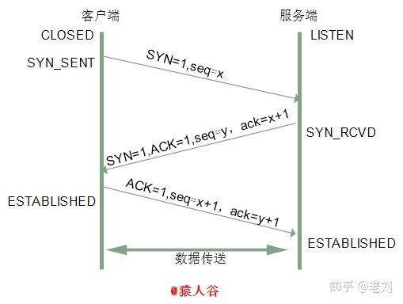

# HTTP连接断开详解

## TCP运输连接的三个阶段：

   1、连接建立
   		2、数据传送
   		3、连接释放建立TCP连接（HTTP协议握手流程）

## 三次握手

> 三次握手其实就是建立一个TCP的连接，需要客户端和服务器总共发送3个包。而三次握手主要的作用是为了确认双方的接受能力和发送能力是否正常，指定自己的初始化序列号为后面的可靠性传送做准备。

**实质是连接服务器的指定端口，建立TCP连接，并同步连接双方的序列号和确认号，交换TCP信息**

刚开始客户端处于**Closed**的状态，服务端处于**Listen**状态

三次握手：



第一次握手：建立连接时，客户端发送 **SYN 报文**，并指明客户端的初始序列号**(seq=x)**到服务器，并进入__SYN_SENT__状态，等待服务器确认；

P.S. __SYN__：同步序列编号（Synchronize Sequence Numbers）。开始 __SYN=1__ ，SYN报文段不携带数据，但要消耗一个序号。初始序号__seq=x__（seq是数据包本身的序列号）。

第二次握手：服务器收到__SYN报文__，会先确认客户的**SYN**，将自己的__SYN__和__ACK__都设置为1，把客户端的初始化序列号+1作为ACK，同时指明了自己的初始化序列号（**seq=y**），发送到客户端即（SYN+ACK）包。此时客户端处于__SYN_REVD__状态。

P.S. 在确认报文段中SYN=1，ACK=1，确认号ack=x+1，初始序号seq=y。 服务端被动打开后,接收到了客户端的SYN并且发送了ACK时的状态。

第三次握手：客户端收到服务器的SYN+ACK包，会检查ack是否为x+1，ACK是否为1，如果正确，则将ACK报文设置为1，向服务器发送确认包ACK报文，将服务器的确认号y +1 作为ack的值。此包发送完毕，客户端进入__ESTABLISHED__，服务器收到ACK报文，服务器进入__ESTABLISHED__完成三次握手。

P.S. 确认报文段 ACK =1，确认号ack=y+1,序列号seq=x+1,ACK报文段可以携带数据，不携带数据不消耗序号

### 问题

### 1.1 为什么要三次握手，两次不行

 第一次握手：客户端发包，，服务器收包 

服务端得出结论：客户端的发送能力和服务端的接收能力正常。

第二次握手：服务器发包，客户端收包。

客户端得出结论：服务端的接受和发送能力正常，客户端的接受和发送能力正常，但是服务端不能确认客户端接受能力是否正常

第三次握手：客户端发包，服务端收包。

服务端得出结论：客户端收发正常，服务端收发正常。

如果只两次， 只要服务端发出确认，就建立新的连接了，此时客户端忽略服务端发来的确认，也不发送数据，则服务端一直等待客户端发送数据，浪费资源。 

### 1.2什么是半连接队列

服务器第一次收到客户端的SYN后，就会处于SYN_RCVD状态，此时对方没有完全建立连接，服务器会把这种状态下请求连接放在一个队列里，我们把这种列队称之为半连接队列。

 当然还有一个全连接队列，就是已经完成三次握手，建立起连接的就会放在全连接队列中。如果队列满了就有可能会出现丢包现象。 

 服务器发送完SYN-ACK包，如果未收到客户确认包，服务器进行首次重传，等待一段时间仍未收到客户确认包，进行第二次重传。如果重传次数超过系统规定的最大重传次数，系统将该连接信息从半连接队列中删除。

### 1.3 ISN(Initial Sequence Number)是固定的吗

ISN是随着时间而变化的，因此每个链接都将具有不同的ISN，每个ISN可以看做是一个32比特的计数器，没4ms加1.这样是为了防止在网络中被延迟的分组在以后又被传送，而导致某个链接的一方做出错误的解释。

### 1.4 三次握手过程中可以携带数据？

只是第一次第二次不能带数据，第三次是可以带数据的。

第一次带数据会让服务器更容易被攻击。

### 1.5 SYN攻击是什么

SYN攻击就是客户端在短时间内伪造大量不存在的IP地址，并向服务端不断发送SYN包，由于源地址不存在，则会导致服务端要不断重复直至超时的回复确认包，这些伪造的SYN包将长时间的占用未连接队列，导致正常的SYN请求因为队列满而被丢弃，从而引起网络堵塞甚至瘫痪。SYN是一种典型的DoS/DDoS攻击。

检查方法，在服务器上看到大量的半连接状态时，特别是IP地址是随机的，则可以判断。在Linux上可以通过系统自带的netstats命令来检测。

```node
netstat -n -p TCP | grep SYN_RECV
```

常见防御SYN攻击方法：

- 缩短超时时间
- 增加最大半数连接数
- 过滤网关防护
- SYN cookies 技术

## 四次挥手


四次挥手，所谓四次挥手（Four-Way Wavehand）即终止TCP连接，就是指断开一个TCP连接时，需要客户端和服务端总共发送4个包以确认连接的断开

第一次挥手：Client发送一个FIN，用来关闭Client到Server的数据传送，Client进入FIN_WAIT_1状态。

P.S. 释放报文段 FIN=1，序号seq=u

第二次挥手：Server收到FIN后，发送一个ACK给Client，确认序号为收到序号+1（与SYN相同，一个FIN占用一个序号），Server进入CLOSE_WAIT状态。

P.S. 服务端收到连接释放报文段后即发出确认报文段 ACK=1,确认号 ack=u+1,序列号seq=v。 此时的TCP处于半关闭状态 。

第三次挥手：Server发送一个FIN，用来关闭Server到Client的数据传送，Server进入LAST_ACK状态。

 P.S. 服务端没有要向客户端发出的数据，服务端发出连接释放报文段（FIN=1，ACK=1，序号seq=w，确认号ack=u+1），服务端进入LAST_ACK（最后确认）状态，等待客户端的确认。 

第四次挥手：Client收到FIN后，Client进入TIME_WAIT状态，接着发送一个ACK给Server，确认序号为收到序号+1，Server进入CLOSED状态，完成四次挥手。

P.S.  客户端收到服务端的连接释放报文段后，对此发出确认报文段（ACK=1，seq=u+1，ack=w+1），客户端进入TIME_WAIT（时间等待）状态。此时TCP未释放掉，需要经过时间等待计时器设置的时间2MSL后，客户端才进入CLOSED状态。 

> 由于TCP连接时全双工的，因此，每个方向都必须要单独进行关闭，这一原则是当一方完成数据发送任务后，发送一个FIN来终止这一方向的连接，收到一个FIN只是意味着这一方向上没有数据流动了，即不会再收到数据了，但是在这个TCP连接上仍然能够发送数据，直到这一方向也发送了FIN。首先进行关闭的一方将执行主动关闭，而另一方则执行被动关闭

### 问题

### 1.1 挥手为什么要四次

服务端收到客户端SYN连接请求报文后，可以直接发送SYN+ACK报文，其中SYN是用来同步，ACK是用来应答。但关闭时，当服务端收到FIN报文时，可能不会立即关闭SOCKET，所以先回复一个ACK报文，告诉客户端发的FIN报文收到了，只有等到我服务器所以的报文都发送完后，才能发送FIN报文，因此需要四次。

### 1.2 2MSL等待状态

TIME_WAIT状态也称为2MSL等待状态。每个具体的TCP实现必须选择一个报文段最大生存时间MSL（Maximum Segment Lifetime），它是任何报文段丢弃前在网络内的最长时间。这个时间是有限的，因此TCP报文段以IP数据报在网络内传输，而IP数据报则有限制其生存时间的TTL字段。

对一个具体实现所给定的MSL值，处理原则是：当TCP执行一个主动关闭，并发最后一个ACK，改连接必须在TIME_WAIT状态停留的时间2倍的MSL,这样可让TCP再次发送最后的ACK，以防止这个ACK丢失。

这种2MSL等待的另一个结果是这个TCP连接字啊等待期间，定义这个连接的插口（客户的IP，端口号，服务器的端口号和IP号）不能再被使用，需要在结束后使用。

### 1.3 等待2MSL的意义

1. 保证客户端发送的最后一个ACK报文段能够达到服务端。

2. 防止“已失效的连接请求报文段”出现在本连接中。

   客户端发送完最后一个ACK报文段后，在经过2MSL，就可以使本连接持续的时间内所产生的所有报文段都从网络小时，使下个新的连接中不会出现旧的连接请求报文段。


