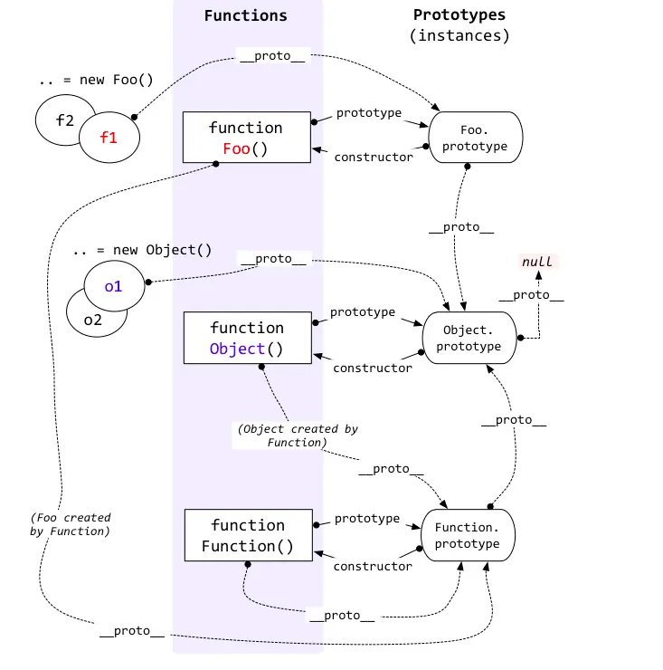

# 原型链




## 相关问题

1. 构造函数不需要返回值。当return**不是对象（数字，字符串，布尔类型，null等）**会**忽略返回值**，当返回的是对象，则返回该对象。

   ``` javascript
   function Person(name) {
       this.name = name
       return name;
   }
   let p = new Person('Tom');
   // {name: 'Tom'}
   
   function Person(name) {
       this.name = name
       return {}
   }
   let p = new Person('Tom');
   // {}
   ```

2. typeof 和 instanceof 的区别

   - **typeof**  一般只能返回如下几个类型：**"number"、"string"、"boolean"、"object"、"function" 和 "undefined"。** 
   -  **instanceof**  用于判断是否为某个对象的实例