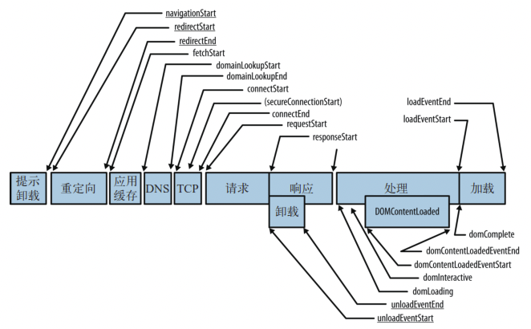

# 性能优化

## 雅虎军规

1. 尽量减少HTTP请求数 
2. 减少DNS查找
3. 避免重定向
4. 让Ajax可缓存
5. 延迟加载组件
6. 预加载组件
7. 减少DOM元素的数量 
8. 跨域分离组件 
9. 尽量少用iframe
10. 杜绝404 
11. 避免使用CSS表达式 
12. 选择<link>舍弃@import 
13. 避免使用滤镜 
14. 把样式表放在顶部 
15. 去除重复脚本 
16. 尽量减少DOM访问 
17. 用智能的事件处理器 
18. 把脚本放在底部 
19. 把JavaScript和CSS放到外面 
20. 压缩JavaScript和CSS 
21. 优化图片
22. 优化CSS Sprite
23. 不要用HTML缩放图片 
24. 用小的可缓存的favicon.ico(P.S. 收藏夹图标) 
25. 给Cookie减肥 
26. 把组件放在不含cookie的域下 
27. 保证所有组件都小于25K 
28. 把组件打包到一个复合文档里
29. Gzip组件
30. 避免图片src属性为空
31. 配置ETags
32. 对Ajax用GET请求 
33. 尽早清空缓冲区(Bigpipe) 
34. 用CDN(内容分发网络) 
35. 添上Expires或者Cache-Control HTTP头

## 浏览器加载分析

1. 对我们比较有用的页面性能数据大概包括如下几个:

DNS查询耗时、TCP链接耗时、request请求耗时、解析dom树耗时、白屏时间、domready时间、 onload时间等，而这些参数是通过上面的performance.timing各个属性的差值组成的，计算方法 如下:

  DNS查询耗时 :domainLookupEnd - domainLookupStart TCP链接耗时 :connectEnd - connectStart   .

 request请求耗时 :responseEnd - responseStart .

  解析dom树耗时 : domComplete- domInteractive   

  白屏时间 :responseStart - navigationStart   

  domready时间 :domContentLoadedEventEnd - navigationStart   

  onload时间 :loadEventEnd - navigationStart   

  NavigationTiming的目的是用于分析页面整体性能指标。如果要获取个别资源(例如JS、图片) 的性能指标，就需要使用Resource Timing API。   

2. 打点请求数据 要用navigator.sendBeacon(“日志请求地址”)发送，因为它是等主渲染进程不 忙的时候进行发送。做埋点最怕的就是影响主进程。   

## CDN

什么是CDN?CDN是构建在网络之上的内容分发网络，依靠部署在各地的边缘服务器，通过中心 平台的负载均衡、内容分发、调度等功能模块，使用户就近获取所需内容，降低网络拥塞，提高 用户访问响应速度和命中率。CDN的关键技术主要有内容存储和分发技术。CDN的基本原理是广泛采用各种缓存服务器，将这些缓存服务器分布到用户访问相对集中的地区 或网络中，在用户访问网站时，利用全局负载技术将用户的访问指向距离最近的工作正常的缓存 服务器上，由缓存服务器直接响应用户请求。

**静态资源文件放入CDN的好处**

1. 加快了静态资源的访问速度。
2. 更加能够合理的设置静态资源的缓存策略。 
3. 减少对主域名的请求压力。请求CDN主域名的Cookies不随着来回传递，减少请求体积。