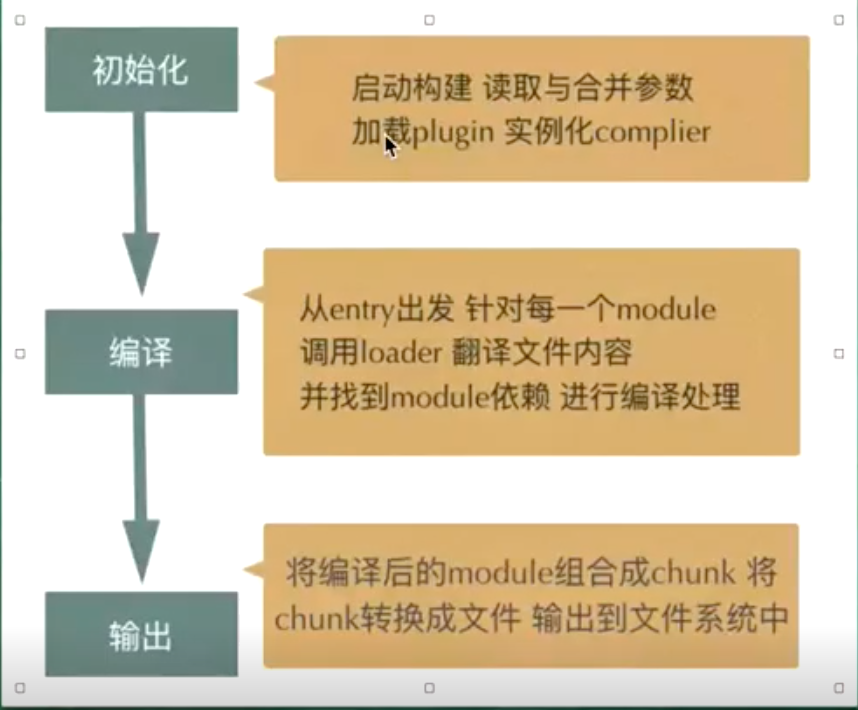

# Webpack

## 编译

开启多核编译

> happyPack在少量的entry的时候体现不出来效果 在webpack5里已经继承了。

``` javascript
const HappyPack = require('happypack');
const os = require('os');
// 开辟一个线程池
const happyThreadPool = HappyPack.ThreadPool({ size: os.cpus().length });
module.exports.plugin = [
  new HappyPack({
    id: 'babel',
    threadPool: happyThreadPool,
    loaders: [{
      loader: 'babel-load',
    }]
  })
]
```

## 模块化

模块化是一种将系统分离成独立功能部分的方法，严格定义模块接口、模块间具有透明性。

### 模块方式

- Commonjs
- AMD
- CMD

### 模块化的价值

建立模块化的标准，能够管理模块之间的依赖，从而提升代码的可维护性和复用性

高内聚，低耦合

## loader

原理: 把文件转成字符串,然后在转成 AST静态语法树，然后分析语法树。

loader 是从后往前执行，第一个是最后一个执行。
并且 是先执行前置钩子，等所有的loader的前置钩子都执行完了，在来执行loader

 用于 AST acorn acorn-walk

``` javascript
//前置的钩子
 module.exports.pitch = function(rRequest,pRequest,data){
     data.value = "ddd"
   }
   // 前置钩子先执行在执行loader
   // use:['babel-loader','css-loader']
   // 执行顺序
   // css-loader pitch
   // babe-loader pitch
   // css-loader
   // babel-loader
```

## plugin

实现插件机制的大体方式
创建-webpack在内部对象上创建各种钩子。
注册-插件将自己的方法注册到对应钩子上
调用-在编译过程中，会适时地触发相应钩子，因此也就触发插件的方法

```javascript
class ConsoleLogOnBuildWebpackPlugin{
    app(compiler){
        compiler.hooks.run.tap(pluginName,compilation=>{
            console.log('构建开始')
        })
    }
}
```

## 构建流程

> tapable是webpack来实现plugin的binding和applying。tapable是一个用于事件发布订阅执行的插件架构。
> 而 compiler 和 compilation 都继承 tapable，所有身上都有tap函数。

1. compiler(所有的构建)
2. compilation (每一次构建)
3. 基于配置创建chunk 
4. 使用 parser 从 chunk 上解析依赖。
5. 使用 module 和 dependency 管理模块之间的依赖关系。
6. 使用 Template 基于 compilation 的数据生成结果代码。

### Compiler

compiler代表了完整的 webpack 环境配置。在启动 webpack 时 compiler 一次性创建，并配好了所有可操作的设置。包括option 、loader 和 plugin 。

webpack 插件里可以通过 compiler 对象访问 webpack 的主环境。

### Compilation

compilation 对象代表了一次资源版本创建，当运行开发环境中间件时，每当检测到一个文件发生变化时，就会创建一个新的 compilation ，从而生成一组新的编译资源。

一个 compilation 对象代表了当前的模块资源、编译生成资源、变化的文件、以及被跟踪依赖的状态信息。同时提供了很多关键的步骤的回调，以供插件做自己定义时选择使用。

### Chunk

chunk 用于表示 chunk 的类，对于构建时需要的 chunk 对象由 compilation 创建后保存管理 。

 webpack 中最核心的负责编译的 Compiler 和负责创建 bundles 的 Compilation 都是 Tapable 的实例。

 ### Module

 module 用于表示代码的基础类，衍生出很多子类用于处理不同的情况，关于代码模块所有的信息都会存在 Module 实例中。

 每当一个 Module 实例被创建后，比较重要的一步是执行 compilation.buildModule 这个方法，它会调用 Module 实例的 build 方法来创建 Module 实例需要的一些依赖，然后调用自身的 runLoaders 方法。

 runLoaders: loader-runner,执行对应的 loaders 将代码源码内容一一交由配置中指定的 loader 处理后，在将结果保存起来。

### Parser

 基于 acorn 来分析 AST 语法树， 解析出代码模块的依赖。

 ### Dependency

 解析时用于保存代码模块对应的依赖使用的对象。 Module 实例的 build 方法在执行完对应的 loader 时， 处理完模块代码自身的转换后，继续调用 Parser 的实例来解析自身的依赖。然后结果放在 Module.dependencies 中。

  首先保存的是依赖路径，后续会经由 compilation.processModuleDependencies 方法，再来处理各个依赖模块，递归去创建整个依赖。

  ### Template

  生成最终代码要使用的代码模块，像上述提到的胶水代码就是用对应的 Template 来生成。



### 事件钩子

``` javascript
const {
    SyncHook,
    SyncBailHook,
    SyncWaterfallHook,
    SyncLoopHook,
    AsyncParallelHook,
    AsyncParallelBailHook,
    AsyncSeriesHook,
    AsyncSeriesBailHook,
    AsyncSeriesWaterfallHook 
 } = require("tapable");
```

异步钩子可以使用 tapPromise 或者 tapAsync 来注册事件函数。

tapPromise 要求返回的是 promise

``` javascript
compiler.hooks.done.tapPromise('PluginName', state => {
    return new Promise((resolve, reject)=>{

    })
})
```

tapasync 要求返回的是 callback(回调函数)

``` javascript
compiler.hooks.done.tapAsync('PluginName', (states, callback) => { callback() });
```

> 名称带有 Parallel ，注册的事件函数都是并行调用，名称带有 Bail 的注册的事件函数都会顺序调用，一直到处理方法有返回值带有 waterfall 的。
> 每个注册的事件函数都会将上一个函数的返回值当做参数。

### webpack运行流程代码实现

``` javascript
    // 1. 创建初始化函数
    (function(modules) { 
        // ....
        return __webpack_require__(__webpack_require__.s = "./src/index.js");
    })({
        "./src/demo.js":(function(){}), // 0
        "./src/index.js":(function(){}),
    })

    //2.定义对象  installedModules 用来缓存模块
    var installedModules = {}

    //定义 __webpack_require__
   function __webpack_require__(moduleId) {
        // 创建一个新模块将他放入缓存模块对象中
         var module = installedModules[moduleId] = {
            exports: {}
         };

         //  3.取出模块
         //  "./src/demo.js":(function(){}),
        modules[moduleId].call(module.exports, module, module.exports, __webpack_require__);
        // 等价于
       (function(module, __webpack_exports__, __webpack_require__){

       }).call(module.exports, module, module.exports,_webpack_require__);

       // 在导出 
       return module.exports;
   }

    // 4.  在分析被入口模块
    // './src/index.js/':(function(){});
    // import demo from 'demo';
    // _0_ webpack 的 chunkId
     var _demo__WEBPACK_IMPORTED_MODULE_0__ = __webpack_require__("./src/demo.js");

    // 能获取到demo里的值
    console.log(_demo__WEBPACK_IMPORTED_MODULE_0__["default"])

    // demo.js
    // modules[moduleId].call(module.exports, module, module.exports, __webpack_require__);
    (function(module, __webpack_exports__, __webpack_require__){
        // ....内部组件代码

        // 在内部组件 module.exports 上挂在了default
         __webpack_exports__["default"] = (demo);

       }).call(module.exports, module, module.exports,_webpack_require__);
       //  return __webpack_exports__
        return module.exports;

    // 如果是异步加载模块
    // 会加载到window[webpackJson] 
    // window[webpackJson]  所有的模块
    window["webpackJson"] = []
```
